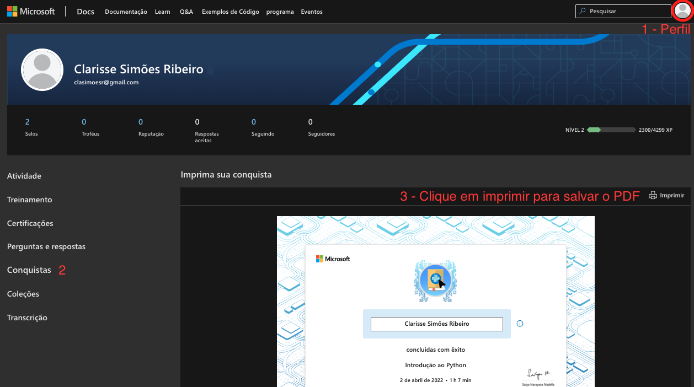

# Aula 01 - Primeiros passos com o Python

## Print, Interpretador, Console e Comentários
### 01_helloworld.py
* A ideia de um programa é que ele faça algo, execute uma tarefa. Para que o programa faça algo, é preciso adicionar instruções de código que sejam executadas. 
* Por exemplo, uma instrução pode imprimir algum texto ou calcular algo. Um exemplo de programa pode ser semelhante a este aqui.
* A função `print` imprime textos na tela.
* Textos podem ser escritos entre aspas duplas ou simples. Escolha uma forma e mantenha a consistência. Vamos seguir o padrão de aspas simples neste repositório.
* O tipo de dados que representa textos é chamado de `string`.
* Para executar um programa em python, podemos utilizar o executável do interpretador Python, seguido pelo nome do arquivo.
* Podemos executar o arquivo *.py* utilizando o interpretador, ou podemos executar o interpretador como um console e digitar os comandos lá de maneira interativa.
* Um console é um aplicativo de linha de comando que permite interagir com o sistema operacional. Você pode executar comandos e programas no console. E também pode inserir informações e exibí-las como texto na tela.
* Por exemplo, os comandos `Get-Command` (Windows PowerShell) ou `which` (Linux bash) podem ser utilizados para mostrar onde está o executável do interpretador Python
* Observe como o comando anterior invoca `print()` usando **parênteses**. Essa é a maneira correta de invocar uma função. Se você usar colchetes ([]), em vez de parênteses, ela não funcionará.
* O "#" representa o início de um comentário. Comentários são ignorados pelo interpretador Python. É uma maneira de você colocar texto livre no seu código para explicar o que está acontecendo. Nas aulas vamos usar comentários como um recurso didático para explicar o que o que o código faz.

### 02_print.py
* `print` insere automaticamente uma quebra de linha. A função sozinha imprime a mesma quebra de linha.
* `\n` é um caractere especial que significa "quebra de linha". Ele permite imprimir uma linha no meio de uma string

## Input e Variáveis
### 03_input_variaveis.py
* O valor digitado pelo usuário representa dados que precisam ser salvos em algum lugar. Para isso, usamos uma **variável**. Uma variável é uma forma de nomear que a gente dá para uma posição na memória.
* Como o programa está trabalhando nos dados, pode ser que seja necessário que o nosso programa se sempre de um determinado valor durante a sua execução do programa.
* Para isso, você deve usar variáveis. Aqui, `nome` é uma variável.
* Note que para salvar um valor na variável `nome`, utilizamos o operador `=`
* Nomes de variáveis não podem começar com números, e não podem ter espaço
* Note que `input`, assim como `print`, é uma função. Para executar uma função, utilizamos a sintaxe de chamada de função com parênteses: `input('mensagem')` e `print('mensagem')`.
  * Note que apesar de `print` e `input` imprimirem uma mensagem no terminal, `print` não retorna nenhum valor enquanto `input` retorna o valor digitado pelo usuário.
* Podemos imprimir textos e variáveis juntos em uma mesma mensagem. Para isso, utilizamos o operador `+` para _concatenar_ a string e a variável.

## Desafio 1
Resolva o desafio proposto no [arquivo do desafio](./04_desafio_1.py)

## Tipos de dados
### 04_types.py
* Para identificar o tipo das variáveis, nós podemos usar a função `type`
* Não é possível concatenar variáveis de tipos diferentes. Para imprimir uma mensagem com uma variável que não seja do tipo string, precisamos converter essa variável para o tipo string usando a função `str`
* Os tipos `int`, `float` e `bool` são considerados tipos **simples** ou **primitivos** pois seus valores não são compostos por outras partes menores. Eles não podem ser quebrados.
* Por outro lado, strings e listas são qualitativamente diferentes desses tipos pois eles são construídos de pedaços menores. No caso de strings, eles são construídos de strings menores, cada um contendo um caractere.

## Strings
### 05_strings.py
* Você pode guardar strings em variáveis
* Essa variável poderá ser reutilizada no seu código em outros momentos
* Você pode combinar strings usando o operador +
* Se você quiser utilizar espaços no meio do texto, você precisa adicioná-los
* Para chamar uma função, digite a string (ou o nome da variável) e utilize o ponto final `.`
* Para visualizar todas as funções, podemos utilizar `ctrl` + `espaço` logo depois de inserir o ponto
* `upper` é uma função que retorna a string toda com letras maiúsculas
* `lower` é uma função que retorna a string toda com letras minúsculas
* `capitalize` é uma função que retorna a primeira letra maiúscula e o resto minúsculas.
* `count` é uma função que conta quantas vezes a letra apareceu na frase
* Para entender mais sobre todas as funções que uma string tem, podemos recorrer a [documentação oficial do Python](https://docs.python.org/pt-br/3/library/stdtypes.html#text-sequence-type-str). A documentação oficial do Python é muito boa, e deverá ser a sua melhor amiga.
* É possível formatar uma string de diversas formas:
  * Utilizando o operador `+`
  * Utilizando a função `format` junto com a sintaxe especial `{}`
  * Utilizando a letra `f` antes de uma string e inserindo variáveis diretamente no meio da frase com a sintaxe especial `{nome_da_variavel}`
  * Utilizando múltiplos parâmetros no comando `print` separados por vírgula. Note que o espaço é adicionado automaticamente entre os parâmetros.
  * Qual usar? Manter a consistência é importante. Escolha um que te dê mais flexibilidade e mantenha o uso dele. Eu particularmente gosto do formato de interpolação de strings.
  * Durante o curso eu vou quebrar essa regra e usar diferentes tipos de print para relembrar essas formas pra vocês.
* Strings são imutáveis em Python. Qualquer tipo de alteração gera uma nova string na memória ao invés de alterar o dado que já está lá.
* O método nativo `len()` pode ser usado para medir o tamanho de uma string, ou seja, medir o número de caracteres que compõe uma string

## Desafio 2
Resolva o desafio proposto no [arquivo do desafio](./07_desafio_1.py)

# Desafios offline - Microsoft Learn
* Complete o módulo [Introdução a Python](https://docs.microsoft.com/pt-br/learn/modules/intro-to-python/).
* Completo o módulo ["Usar cadeias de caracteres no Python"](https://docs.microsoft.com/pt-br/learn/modules/python-strings/)
* Para receber os créditos pelo módulo, necessário criar uma conta gratuita no site do Microsoft Learn.
* Ao finalizar um módulo, você receberá um selo de conclusão no formato PDF. Não deixe de acrescentar o selo no seu GitHub! Para fazer download do selo, basta ir no seu perfil, entrar no menu "Conquistas" e selecionar o selo com o nome do módulo que você completou.
  * Adicione os selos que você ganhar na pasta [selos_microsoft_learn](../selos_microsoft_learn/).
  * A imagem abaixo mostra como encontrar seus selos na plataforma Microsoft Learn. Ao clicar em "imprimir", você poderá salvar o arquivo PDF.

* Nota: algumas coisas não são automaticamente traduzidas nos exercícios do Microsoft Learn. Você pode utilizar o site de tradução de sua preferência se não entender o conteúdo das orientações dos exercícios.