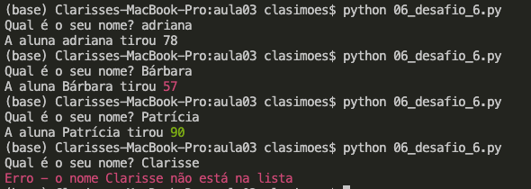

# Aula 03 - Listas, arrays, estruturas de repetição, funções, módulos e pacotes

## Listas
### 01_listas_arrays.py
* Se eu quiser agrupar vários dados, eu posso fazer isso de maneiras diferentes.
* Para agrupar dados, o Python tem o que a gente chama de "coleções".
* Existem diferentes tipos de coleções: listas, arrays, dicionários e conjuntos (_sets_).
* Vamos discutir aqui as listas e os arrays.

**Listas**
* Listas são coleções que podem agrupar qualquer tipo de dado. 
* Em Python elas são representadas com a sintaxe de colchetes `[]`.
```python
cachorros = ['Dori', 'Mei', 'Boni', 'Diana']
```
* No exemplo acima, estamos inicializando uma lista de nomes de cachorro com 4 valores.
* Outra forma de inicializar uma lista é criando uma lista vazia e acrescentar itens aos poucos através da função `append`. Essa função acrescenta itens ao final da lista.
```python
cachorros = [] # lista vazia
cachorros.append('Dori')
cachorros.append('Mei')
cachorros.append('Boni')
cachorros.append('Diana')
```
* Para acessar um item em uma lista, utilizamos índices. Os índices começam com o valor 0.
* Múltiplos itens podem ser acessados através de índices também
  * `cachorros[início:fim]`: retorna o pedaço da lista com os índices `início` até `fim-1`. O primeiro índice indicado é íncluído, e o segundo não é incluído.
  * Você pode omitir qualquer um dos índices de início ou de fim. Por padrão, isso vai fazer com que todos os itens do início ou do fim da lista sejam adicionados no seu pedaço respectivamente.
  * Índices negativos cortam pedaços relativos ao fim da lista.
* Por padrão, os índices pegam itens consecutivos da lista, mas é possível especificar "passos" maiores ou menores. Por exemplo, se eu quiser um pedaço que pega um item e pula outro, posso usar um passo igual a 2.
  * Um uso iteligente do passo é especificar um passo de valor -1 para reverter uma lista.
* Listas guardar os elementos em ordem. Sempre que você acessar o elemento no índice 0, se a lista não tiver sido alterada, ele vai retornar o mesmo valor.
* Para ver o tamanho de uma lista podemos usar o método `len()`
  * Esse método é genérico e podemos usá-lo para saber o tamanho de outras coleções, não só de listas
* Podemos inserir itens em uma posição específica da lista com o método `insert()`.
* Também podemos ordenar uma lista através do método `sort()`.
  * Usar esse método vai alterar a sua lista internamente, cuidado.
* Podemos apagar itens de uma lista através dos métodos `remove()` ou `pop()`.
  * `remove(e)` remove a primeira ocorrência do elemento `e` na lista.
  * `pop()` remove e retorna o último item da lista.
* É possível guardar itens diferentes em uma lista. No entanto, isso não é muito comum, porque geralmente vamos precisar que os itens tenham interfaces comuns para que possam ser processados em algum momento no código.
* Você pode inclusive guardar listas dentro de listas. Isso é o que nós chamamos de _listas aninhadas_.

**Arrays**
* São coleções que só podem ter dados de tipo numérico.
* Ao contrário das listas, que podem ser criadas a qualquer momento sem nenhuma biblioteca especial, para usar arrays nós precisamos importar este tipo de uma biblioteca, assim como fizemos com as datas.
* Para inicializar um array, precisamos criar um objeto e passar qual vai ser o tipo numérico que o array vai guardar.
  * Ao contrário das listas, os arrays só podem guardar dados de um tipo, e esse tipo precisa ser numérico.
* Podemos inicializar um array acrescentando itens no final com o `append` ou passando uma outra coleção de dados.
  * Arrays também mantém a ordem dos elementos internamente.
* Para ver o tamanho de um array podemos usar o método `len()`.
* Podemos inserir itens em uma posição específica do array com o método `insert()`.
* Podemos apagar itens de um array através dos métodos `remove()` ou `pop()`.
  * `remove(e)` remove a primeira ocorrência do elemento `e` no array.
  * `pop()` remove e retorna o último item do array.


**Como escolher entre uma lista ou um array?**
* Geralmente utilizamos arrays quando queremos processar dados numéricos, por isso arrays são muito utilizados na área análise de dados.
  * Arrays são mais utilizados para processamento eficiente de números. Se seu programa precisar armazenas 10 milhões de valores do tipo `float`, por exemplo, um array será muito mais eficiente do que uma lista.
  * Por exemplo: imagens em 3D na verdade são grandes matrizes que precisam ser recalculadas muitas vezes por segundo. Cada número vai ajudar a compor um conjunto de pixels na tela. Para que a imagem não fique parada (estática), essas cores precisam ser atualizadas e tem muitas contas acontecendo por baixo dos panos pra gerar essas matrizes corretamente.
  * Existem bibliotecas especiais de Python para lidar com arrays e aumentar a performance de computações com números. Talvez alguém aqui já tenha ouvido falar da biblioteca `numpy`.
* Listas são mais flexíveis já que elas podem guardar qualquer tipo de dado (não precisa necessariamente números).
  * Por serem genéricas, são amplamente utilizadas em todos os tipos de aplicações.
  * Muito utilizadas em **loops**.

## Estruturas de repetição (loops)
### 02_loops.py

* `Loops` são formas de executar o mesmo código várias vezes para processar cada item de uma coleção.
* Em Python existem duas formas de processar coleções.

**Loops `for`**
* Repetições com `for` pegam um item de cada vez em ordem na coleção, e cada item é associada a uma variável que é definida por você.
```python
for nome in ['Dori', 'Mei', 'Boni', 'Diana']:
  print(nome)
```
* Para rodar um processamento por um número limitado de vezes, podemos usar a função nativa `range()`.
  * A função `range()` cria uma lista de números automaticamente levando em conta o os índices inicial e final que você especificar. O primeiro índice é incluído e o segundo fica de fora, assim como vimos com os "pedaços" de listas.
  * Você pode inclusive usar essa função para inicializar uma lista de números.
* Também podemos gerar um valor de índice associado a cada item da sua lista automaticamente utilizando a função `enumerate`.
  * `enumerate` recebe como parâmetro uma lista e retorna dois valores: um índice e um item da lista.
  * `enumerate` também respeita a ordem dos itens da sua lista ou array.
* Um loop `for` pode ter sua execução interrompida de maneira forçada com o uso do comando `break`.
* Podemos pular o processamento de um item no loop com o comando `continue`.

**Loops `while`**
* Repetições `while` realizam uma operação enquanto uma determinada condição é verdadeira.
```python
while len(nomes):
  item = nomes.pop()
  print(item)
```
* Preste muita atenção: a condição precisa ir mudando durante o loop `while`. Caso a condição nunca se torne `False`, você fará seu programa ficar preso em um _loop infinito_ até que o sistema operacional force a interrupção do seu programa.
* Também podemos usar as palavras-chave `break` e `continue` com loops `while`.

**Como escolher entre um loop `while` ou `for`?**
* Em geral, `while` loops são adequados quando estamos realizando alguma operação em que uma condição muda automaticamente.
  * Exemplo: ler um arquivo de texto linha a linha.
* O uso dos loops `for` é mais comum nos programas. Em geral, é uma sintaxe mais simples (porque é mais explícita) e menos passível de ter um problema com loops infinitos.

## Desafio 5
Resolva o desafio proposto no [arquivo do desafio](./03_desafio_5.py)

## Funções
### 04_funcoes.py
* Nós já usamos algumas funções até aqui: `print()`, `input()`, funções de lista como `append()`, `remove()`, `pop()`, funções nativas da linguagem como `len()`, `int()`, `str()`, `float()` e outras.
* Agora vamos entender direito o que são essas funções e como criar as nossa próprias funções.
* Funções servem pra gente criar blocos de códigos que podem ser utilizados várias e várias vezes sem que a gente precise copiar e colocar esse código várias vezes.
* Em várias situações nós acabamos escrevendo as mesmas linhas de código várias vezes, e até copiamos o código usando ctrl+c e ctrl+v.
* Quando você perceber que está re-escrevendo as mesmas linhas de código, essa é a hora de parar e transformar esse bloco em uma função.
  * Exemplo: se você estiver trabalhando em um sistema que mede reporta em seus logs o tempo que cada processamento demora, você pode escrever linhas de código para saber a hora em que uma tarefa no código começou e a hora em que ela terminou.
* A forma mais simples de definir uma função é mostrada no código abaixo:
```python
def minha_funcao_1():
    # codigo que quero executar aqui
```
* A palavra chave `def` indica o início da definição de uma função.
* Uma função pode ter ou não ter **parâmetros**, que são variáveis que podemos passar para tornar nossas funções mais flexíveis.
```python
def minha_funcao_2(param):
    if param:
      # executa uma lógica
    else:
      # executa outra lógica
```
* O uso de funções torna o código mais limpo, mais legível e mais fácil de dar manutenção.
  * Se o mesmo código está repetido em diversos pontos da sua aplicação e você precisa realizar alguma alteração, você vai ter que alterar a lógica em vários lugares diferentes. Além disso ser muito mais trabalhoso, também aumenta muito a possibilidade de bugs.
* Parâmetros podem ser passados para uma função por ordem ou por nome.
  * Para funções que possuem vários parâmetros, chamar a função passando os parâmetros pelo nome ajuda a tornar o código mais legível.
* Funções podem executar algum tipo de processamento e retornar um valor como resultado desse processamento.
  * Exemplo: A função `input('mensagem')` imprime uma mensagem e coleta o valor que o usuário digita. Esse valor é retornado pela função e pode ser salvo em uma variável.
  * `return` é a palavra chave usada para definir o retorno de uma função.
  * Depois da linha que escrevemos o `return` geralmente não faz sentido colocar mais nenhum outro código na mesma identação porque ele não será executado.
  * Ter um valor de retorno não é obrigatório para uma função e depende muito da lógica. Se a lógica "de fora" esperar um resultado calculado no processamento, então o uso do `return` faz sentido.
  * `return` pode ser usada dentro de um bloco condicional no meio de uma função para criar lógicas que retornam valores diferentes dentro de uma mesma função.
  * Podemos definir explicitamente o tipo de retorno esperado na definição da função. Em um código mais extenso (mantido por mais de uma pessoa), ou em uma função mais complexa, isso ajuda a tornar a intenção do programador mais explícita e, portanto, facilita a manutenção.

**Variáveis globais e locais**
```python
variavel_global = 'global teste'
def minha_funcao():
    global variavel_global
    variavel_local = 'local_teste'
    variavel_global = 'outro valor'
```
  * Variáveis declaradas dentro de uma função não podem ser acessadas fora dela. Neste caso, dizemos que a variável é **local** porque ela só existe dentro do seu escopo, que é a delimitado pela função onde é declarada.
  * Variáveis declaradas fora de qualquer função são chamadas de **globais**. Elas se encontram em um escopo que é acessível em qualquer parte do seu script e também por outros módulos.
  * Uma aplicação comum de variáveis globais é o armazenamento de valores constantes no programa, que ficam acessíveis para a todas as funções.
  * Para alterar variáveis globais dentro de funções, precisamos indicar a função que estamos querendo alterar a variável do escopo global. Caso contrário, outra variável de mesmo nome é criada dentro do escopo da função e é alterada apenas localmente.

## Módulos e namespaces
### Slide
**Módulos e Namespaces - Slide**
* Suponha que você criou alguma funções que quer poder reutilizar em arquivos diferentes do seu sistema. **Módulos** são locais onde você define os nomes e funções que quer quer fiquem visíveis para o resto do seu sistema.
* Falando tecnicamente, um módulo é um “espaço que serve para a declaração de nomes”, ou seja, um _namespace_.
* Na prática, um módulo é um arquivo Python. O nome do módulo é o nome do arquivo tirando a extensão .py.
* Em um módulo podem ser definidos componentes reutilizáveis em outros arquivos Python. Ex: variáveis, funções, classes, etc.
* Módulos nos permitem quebrar o nosso código em blocos de código menores e reutilizáveis.
* Para criar um módulo, você só precisa criar um arquivo python (.py) e escrever suas funções lá dentro.
* Cuidado: se você importar um módulo ou função cujo nome tem conflito com algum objeto definido no seu namepsace local, o objeto do seu namespace local vai sobrescrever o que foi importado.
  * Isso acontecerá se o objeto do namespace local for declarado depois daquele que foi importado.
  * Como geralmente deixamos os imports no início do arquivo, esse é o caso mais comum.

### 05_modulos/funcoes_do_log.py
* Neste exemplo vamos criar o módulo "funcoes_do_log" (note que o nome do módulo é o nome do arquivo omitindo sua extensão).
  * Declaramos em nosso módulo um atributo e uma função.

### 05_modulos/import.py
```python
# importar um módulo na forma de um namespace separado
import meu_modulo
meu_modulo.mostrar_mensagem('Aviso: bateria fraca.')
```
* Assim como vimos no slide, a primeira forma de importar um módulo é utilizando apenas a palavra-chave `import`.
* Ao importar o módulo desta forma, para usar o que foi declarado em nosso módulo, precisamos sempre usar a sintaxe `nome_do_modulo.atributo` ou `nome_do_modulo.funcao`.
* Na prática, precisamos sempre dizer para o interpretador de qual _namespace_ vem os itens que estamos querendo usar no namespace corrente.
  

### 05_modulos/from_import_tudo.py
```python
# importar tudo que existe no módulo para o namespace atual
from meu_modulo import *
mostrar_mensagem('Aviso: bateria fraca.')
```
* Para importar todo o conteúdo do módulo "funcoes_do_log" para o _namespace_ local, podemos utilizar a palavra-chave `from` junto com o `import *`.
* O asterisco indica que queremos importar todo o conteúdo deste módulo.
* Não é necessário especificar o _namespace_ de onde vêm as coisas que você quer usar porque os nomes são importados para o _namespace_ corrente.
* Esse tipo de abordagem costuma não ser uma boa prática porque "polui" muito o seu ambiente trazendo vários nomes que nunca serão usados em seu programa.
* Para solucionar este problema, podemos especificar importar apenas os itens que queremos usar de um determinado módulo para o _namespace_ corrente.

### 05_modulos/from_import_especifico.py
```python
# importar itens específicos do módulo para o namespace atual
from meu_modulo import mostrar_mensagem
mostrar_mensagem('Aviso: bateria fraca.')
```
* Para importar partes específicas do módulo "funcoes_do_log" para o _namespace_ local, podemos utilizar a palavra-chave `from` junto com o `import`.
* Ao invés de usar o asterisco, especificamos os nomes que queremos importar para o _namespace_ corrente.
* Dessa maneira, o _namespace_ corrente fica mais limpo e o "autocompletar" do VS code também :)
* Lembram do `datetime`? Quando nós usamos `from datetime import datetime`, o primeiro item é o nome do módulo e o segundo é o nome de uma classe.

### 05_modulos/conflito.py
* Um risco de importar tudo que existe em um módulo é ter uma outra função ou variável no _namespace_ corrente com o mesmo nome.
* Neste caso, é fácil ter um bug porque você pode ao invés de usar um método, o programador acaba usando o outro.

## Pacotes
* Um **pacote** é uma coleção de módulos que foi disponibilizada publicamente.
* Pacotes são arquivos externos ao sistema que estamos desenvolvendo.
* Provavelmente todas as aplicações em que você for trabalhar precisarão usar pacotes.
* Já existem pacotes para incontáveis funcionalidades: analisar dados (pandas, numpy, matplotlib), colorir o que é impresso no terminal (colorama), lidar com geração de boletos, converter moedas, etc.
  * Na prática, antes de começar a implementar uma funcionalidade nova, sempre é bom buscar se já não existem pacotes prontos que podemos usar para fazer o que queremos.
  * O [Python Package index](https://pypi.org/) contém a lista de todos os pacotes públicos que podem ser instalados utilizando o comando `pip` no terminal.
* Importar módulos que estão em um pacote funciona da mesma forma que importar módulos criados diretamente no sistema, exceto que precisamos baixar o pacote primeiro para o ambiente.

## Instalação de pacotes - Slide
* Para instalar pacotes, a nossa instalação do Python conta com o comando `pip`
  * Importante: O comando `pip` deve ser usado no terminal, não em um script python.
* Para instalar um pacote individualmente, podemos usar `pip install [nome_do_pacote]`, ou manter um um arquivo com uma lista de todos os pacotes que são utilizados no projeto.
* Geralmente é uma boa prática manter um arquivo de pacotes necessários para fazer aquele projeto funcionar. Desta forma, outros desenvolvedores e usuários do sistema têm acesso a mesma lista.
  * O nome deste arquivo chamado costuma ser _requirements.txt_
  * O conteúdo desse arquivo é o nome de um pacote por linha
  * Para instalar as dependências listadas no arquivo _requirements.txt_, é preciso rodar no terminal o comando `pip install -r requirements.txt`

### funcoes_do_log_colorido.py
* Neste arquivo alteramos um pouco a nossa função de imprimir mensagens no log para ela imprima o nível da mensagem com a fonte colorida.
* Depois de instalar o pacote `colorama`, nós podemos importá-lo de forma semelhante ao que fizemos anteriormente.
  * O pacote exige que a função `colorama.init()` seja chamada antes do seu uso.
  * Como eu sei disso? Procurei no Google :) [veja o exemplo](https://www.delftstack.com/pt/howto/python/python-print-colored-text/)

### pacote.py
* O neste arquivo vamos importar o módulo que nós criamos e usá-lo para imprimir mensagens com o início colorido.

## Desafio 6
Você é a professora de Ciências e está lançando as notas das alunas. Você quer criar um sistema no qual suas alunas podem ver suas notas digitando o nome. As listas de alunas e notas se encontra no [arquivo do desafio](06_desafio_6.py). Nessas listas, as notas estão na mesma ordem dos nomes, ou seja, a aluna no índice 4 tirou a nota no índice 4. As notas podem variar de 0 a 100.

Crie um programa que pergunte o nome da aluna e em seguida imprima uma mensagem com a nota que ela tirou. Notas abaixo de 60 devem ser impressas com a cor vermelha, e notas a partir de 90 devem ser impressas com a cor verde, assim como mostrado na figura abaixo. Se o nome digitado não existir na lista, imprima uma mensagem de erro usando a cor vermelha.



# Desafios offline - Microsoft Learn
* Complete o módulo ["Usar loops "while" e "for" em Python"](https://docs.microsoft.com/pt-br/learn/modules/python-loops/).
* Não esqueça de adicionar os PDFs que comprovam que você completou estes módulos [na pasta de selos](../selos_microsoft_learn/).
