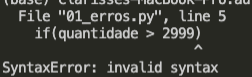

# Aula 04 - Erros e tratamento de exceções, Debug, Listas (parte 2), Pilhas, Filas, Tuplas 

## Tratamento de Exceções
### 01_erros_excecoes.py
* Erros em Python podem ser de dois tipos: **erros de sintaxe** ou **exceções**.
**Erros de sintaxe**
* Quando o interpretador encontra um erro de sintaxe, a execução do programa é interrompida imediatamente.
```python
quantidade = 10000

if(quantidade > 2999)
print("Você tem mais de 3000 dinheiros.")
```

* No exemplo acima temos dois erros: faltam os dois pontos depois da condição do `if` e a linha abaixo dele não está identada.
* Erros de sintaxe são comumente fáceis de serem corrigidos, uma vez que você entenda o qual é o problema.
* As mensagens mais comuns são `SyntaxError: invalid syntax` e `SyntaxError: invalid token`
  * As mensagens indicam onde no programa o erro ocorreu. Na verdade, ele diz a você onde o Python notou o problema, que não é necessariamente onde está o erro.
  * Algumas vezes o erro está localizado em um ponto anterior ao indicado pela mensagem de erro, frequentemente na linha anterior
* Os erros de sintaxe mais comuns:
  * Certifique-se que você não está usando uma palavra reservada do Python (Python keyword) como nome de variável.
  * Verifique que você colocou um dois-pontos (`:`) no final do cabeçalho de cada comando composto (compound statement), incluindo laço `for`, laço `while`, comandos de seleção `if`, `elif` e `else` e declaração de funções `def`.
  * Verifique se a tabulação é consistente. Você pode tabular com espaços ou tabs mas não é aconselhável misturá-los. Cada nível deve ter a mesma quantidade de espaços ou tabs.
  * Verifique seas aspas ou apóstrofes de qualquer string no código estão emparelhados.
  * Uma falta de fecha parêntese, chave ou colchete – `(`, `{` ou `[` – faz o Python continuar com a próxima linha como parte da expressão corrente. Geralmente, um erro ocorre quase que imediatamente na próxima linha.
  * Verifique pelo clássico `=` em vez de `==` em uma condição.
  
**Exceções**
* Quando uma exceção acontece, o programa pode ser interrompido ou não dependendo de como ela é _tratada_.
* Quando acontece algum erro que não é relacionado a sintaxe da linguagem, mas sim a lógica da execução, esse erro é chamado de exceção.
* Exceções acontecem em tempo de execução, ou seja, durante a execução de uma linha do programa.
* Por exemplo, ao dividir qualquer número por zero o Python gera uma exceção com o tipo `ZeroDivisionError`.
```python
quantidade = 10000

resultado = quantidade / 0
```

* Note que a mensagem de erro relativa a uma exceção começa com a palavra "Traceback" e mostra em qual arquivo em qual linha o erro de lógica acocnteceu. A mensagem também mostra qual foi o tipo de exceção lançada (`ZeroDivisionError`).
* É muito importante prestar atenção na mensagem de erro. Parece bobo dizer isso, mas é onde normalmente a maior parte das pessoas perde muito tempo: tentando entender porque um erro acontece. A mensagem é a sua maior e melhor pista, e geralmente ela indica exatamente o problema que deve ser corrigido.
* É possível tornar o seu programa mais robusto através do tratamento de exceções. Ou sej,a podemos deixar indicar no nosso código o que fazer quando uma exceção acontecer para evitar que a execução seja interrompida.
* Para isso, utilizamos as palavras chaves `try`, `catch` e `finally`.
  * Colocamos o código que pode lançar exceções dentro do bloco `try`.
  * Utilizamos o bloco `catch` para capturar e tratar qualquer exceção que possa vir a ser lançada pelo código no bloco `try`.
  * Podemos adicionar um bloco `else` com código que só vai ser executado se nenhuma exceção acontecer
  * Se existe alguma coisa que precisa ser executada indepedendo ou não do erro acontecer, podemos utilizar opcionalmente o bloco `finally`.
```python
try:
    # Algum código.... 
except:
    # Bloco opcional para lidar com uma exceção (se necessário)
else:
    # Código para ser executado se não ocorrer nenhuma exceção no try
finally:
    # Código para sempre ser executado independente de acontecer
    # alguma exceção ou não
```
* O Python possui diversos tipos de exceções que podem ser encontrados na [documentação oficial](https://docs.python.org/pt-br/3.7/library/exceptions.html#concrete-exceptions).
* Podemos lançar nossas próprias exceções no código para indicar erros de execução utilizando a palavra-chave `raise`. A mensagem do erro pode ser personalizada.
* É possível criar seus próprios tipos de exceções. Vamos ver mais sobre isso nó módulo 2 quando falarmos de classes e orientação a objetos.

## Debug
### 02_debug.py

* O primeiro passo em depurar (_debugging_), ou seja, investigar e eliminar erros de programação, é identificar que tipo de erro você cometeu.
* A forma mais básica de debugar é utilizando o `print` para mostrar até que parte do código rodou e quais eram os valores das variáveis.
* Geralmente, os ambientes de desenvolvimento oferecem suas próprias ferramentas de debug. A outra forma de debugar é utilizando a ferramenta de debug do VSCode.
* Exemplo de código: considere que você trabalha para um banco e está criando um aplicativo que monitore o valor do saldo da conta de um cliente. Este cliente recebe o salário em sua conta e o banco precisa processar o valor bruto para reter o valor referente ao imposto de renda. Depois, se o cliente quiser sacar, o banco precisa controlar o valor do saque para não permitir que o cliente gaste mais do que o valor que existe em sua conta. Seu programa usa o módulo `conta_bancaria`, que contém as seguintes funções:
  * `imprimir_no_log` para mostrar mensagens coloridas
  * `calcular_inss` e `calcular_imposto_de_renda` para que calcular os valores de impostos
  * `processar_salario`, que deve rodar apenas da primeira vez que o usuário tentar sacar o valor para retenção dos valores pagos na fonte
  * `sacar_na_conta`, que faz o saque e retorna um boolean indicando se a operação funcionou corretamente.
* O módulo também contém variáveis que indicam o saldo inicial da conta, o valor do salário bruto e o estado do processamento do salário.
* Erros no código:
  1. faltou colocar o namespace "conta_bancaria" para chamar a função "sacar na conta"
  2. Função "sacar_na_conta": variável 'valor_na_conta' é local - não disse para a função que estava usando a variável global
  3. Mesmo erro na funcao 'processar_salario'
  4. Expressão do 'processar_salario' usando o valor errado
  5. `if valor_na_conta <= valor:` -> lógica invertida
  6. Faltou atualizar a variável `salario_processado` que está sendo repetida

## Desafio 7
Resolva o desafio proposto no [arquivo do desafio](./03_desafio_7.py)

## Listas - Parte 2
### 04_listas.py
* Uma das funcionalidades mais amadas de Python são as **list comprehensions ("compreensão de listas")**.
* Essa funcionalidade permite criar listas de maneira simples, em apenas uma linha. _List comprehensions_ fazem parte da forma "pythônica" de programar, porque tornam o código mais conciso e limpo.
* Para inicializar uma lista utilizando essa funcionalidade, a sintaxe é a seguinte:
```python
[expressao for valor in colecao_de_entrada if condicao]
```
* O interpretador Python entende que os colchetes indicam a criação de uma lista a partir da coleção de entrada indicada no loop `for`. Cada valor do `for` é testado pela `condicao` do filtro, e é usado em na variável `expressao`. Cada `expressao` se torna um item na lista criada.
* Por exemplo, considere o seguinte código:
```python
resultado = []
for val in dados_de_entrada:
    if val > 10:
        resultado.append(val * 5)
```
* A lista `resultado` acima pode ser criada por uma _list comprehension_ equivalente:
```python
resultado = [valor * 5 for valor in dados_de_entrada if valor > 10]
```
* Strings também podem ser pensadas como listas de caracteres. Os operadores de _slicing_ (fatiamento) funcionam com strings.
* Podemos converter strings em listas facilmente usando a função `list()`. O resultado é uma lista de strings, onde cada caracter se torna um item da sua lista.
* A palavra-chave `del` pode ser usada para remover um item de uma lista usando seu índice no lugar do seu valor.
  * Ela é diferente do do método `pop()` porque `pop()` retorna o valor removido, enquanto `del` apenas remove o valor naquele índice.
  * A instrução del pode também ser utilizada para remover fatias de uma lista ou limpar a lista inteira.
  * Referenciar a variável da lista depois de sua remoção gera uma exceção.
* Pilhas
  * Os métodos de lista tornam muito fácil utilizar listas como pilhas, onde o item adicionado por último é o primeiro a ser recuperado (política “último a entrar, primeiro a sair”).
  * Para adicionar um item ao topo da pilha, use `append()`. Para recuperar um item do topo da pilha use `pop()` sem nenhum índice.
* Filas
  * Você também pode usar uma lista como uma fila, onde o primeiro item adicionado é o primeiro a ser recuperado (política “primeiro a entrar, primeiro a sair”). Porém, listas não são eficientes para esta finalidade.
  * Apesar de `append`s e `pop`s no final da lista serem rápidos, fazer `insert`s ou `pop`s no início da lista é muito lento.
  * Isso porque todos os demais elementos têm que ser deslocados.
  * Para implementar uma fila, use a classe `collections.deque` que foi projetada para permitir `append`s e `pop`s eficientes nas duas extremidades.
  * A classe `collections.deque` por baixo dos panos é o que chamamos de **lista duplamente ligada**. Ela foi projetada para 
* Mais sobre listas na [documentação oficial do Python](https://docs.python.org/pt-br/3/tutorial/datastructures.html#more-on-lists).


## Tuplas
### 05_tuplas.py
* **Tuplas**, assim como listas, são containers de dados em Python. No entanto, as tuplas não podem ser alteradas, ou seja, são **imutáveis** e possuem tamanho fixo.
* Tuplas podem guardar dados de tipos diferentes.
* A forma mais fácil de se criar uma tupla é através de uma sequência de valores separados por vírgula e entre parênteses:
```python
tupla = (2, 3, 4)
```
* Os parênteses são opcionais, mas é uma boa prática adicioná-los para tornar mais claro que algo é uma tupla.
* Os elementos em uma tupla podem ser acessados por índices, que começam em 0. Também é possível acessar pedaços de tuplas.
* Uma vez que a tupla é criada, não é mais possível alterar qual objeto está em qual índice.
  * Essa característica é interessante para passar dados pelo sistema que não podem ser alterados. Por exemplo: dados que são lidos de um banco de dados.
* No entanto, objetos dentro da tupla podem ser mutáveis.
* É possível criar uma nova tupla concatenando duas ou mais tuplas ou usando o operador de multiplicação, assim como acontece com listas.
* Como tuplas não podem ser modificadas, poucos métodos existem para lidar com elas: 
  * `tupla.count(valor)` conta quantas vezes `valor` aparece dentro da tupla;
  * `len(tupla)` conta quantos elementos existem em uma tupla;
  * `max(tupla)` e `min(tupla)` buscam o maior e menor valor em uma tupla respectivamente.
* Tuplas podem ser **desempacotadas** e seus valores podem ser assinalados a múltiplas variáveis no código.
  * Usos comum do desempacotamento são iterar em sequências de tuplas e retornar múltiplos valores em uma função.
  * É possível assinalar valores de algumas variáveis a partir de uma tupla e capturar os valores restantes com a sintaxe especial `*`.
```python
valores = (1, 2, 3, 4, 5)
a, b, *outros = valores
```

## Desafio 8 - Menti
Acesse o desafio no link https://www.menti.com/fbrmdodn37

# Desafios offline - Microsoft Learn
* Complete o módulo ["Introdução às listas no Python"](https://docs.microsoft.com/pt-br/learn/modules/intro-python-lists/).
* Não esqueça de adicionar os PDFs que comprovam que você completou estes módulos [na pasta de selos](../selos_microsoft_learn/).